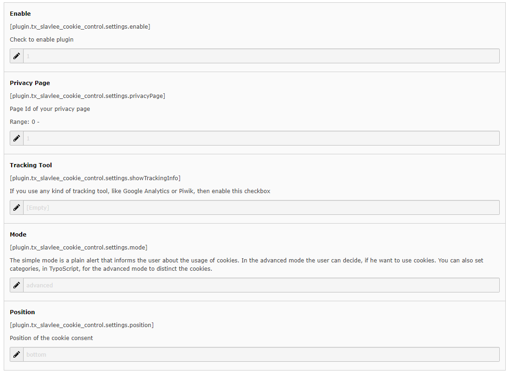

.. include:: ../Includes.txt

.. _for-editors:

===========
For Editors
===========

The editor has a few settings that he can do in the constant editor.

	Constant editor settings of Slavlee Cookie Control

					
=================== =================== ===================
Property    		Type				Description
=================== =================== ===================
enable				boolean				Show or hide Slavlee Cookie Consent
privacyPage			boolean				Page ID of the TYPO3 page, where you have your privacy statement.
showTrackingInfo	string				If you are using a tracking tool, then you can enable this option to display a notice message inside the Cookie Consent alert.
mode				string				Choose between simple and advanced mode. 
										The simple mode only display a cookie alert with a link to the privacy page. The
										simple mode is no opt-in and there is no integrated opt-out function.
										The advanced mode display your categories and services. 
										This mode set your TYPO3 up for opt-in, because it can delete cookies and block urls.
										In the frontend the user sees the categories inside the alert and all services in the modal box. 
										All services, except the mandatory ones, can be accepted/denied individually.
position			list				The position of the alert box. In Slavlee Cookie Control Free you only have the bottom position available.
=================== =============== ===================

Everything else is set up in TypoScript setup part, which needs to be done by the administrators.