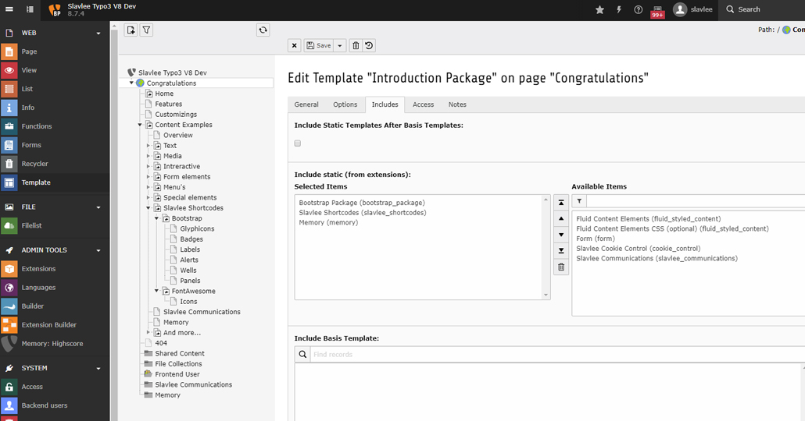

.. include:: ../Includes.txt

.. _installation:

============
Installation
============

Slavlee Cookie Control can be installed in the TYPO3 Extension Manager by uploading the zip there,
or searching for slavlee_cookie_control in the TER and click on install.

**Dependencies**
There are no dependencies except the TYPO3 core.

After installation you have to add the StaticTS in your sys_template:

   Add Slavlee Cookie Control StaticTS in your sys_template
   
**That's it!**   
   
   