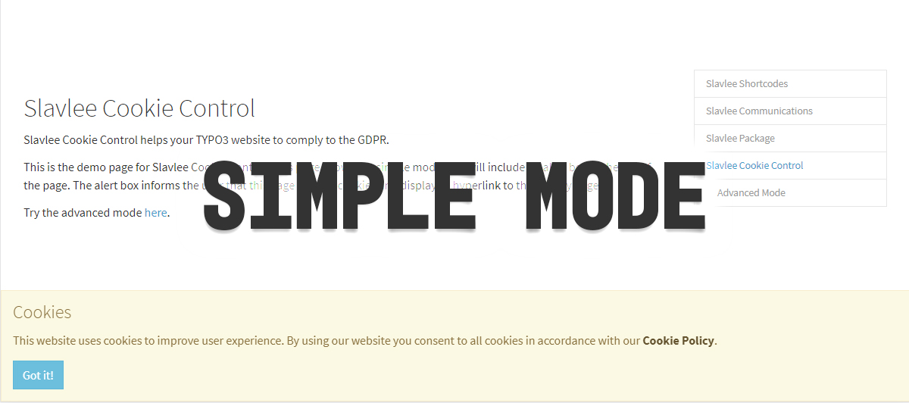
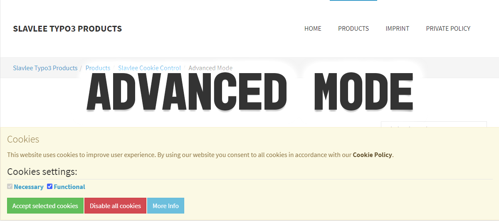
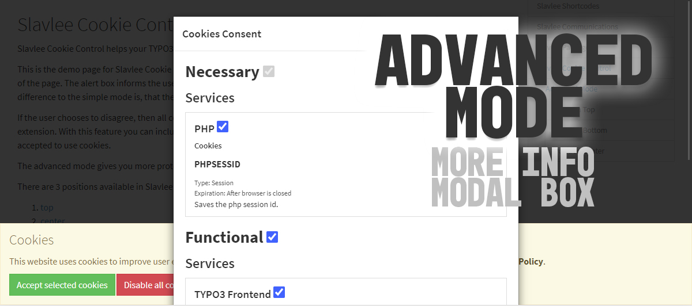

.. include:: ../Includes.txt

.. _introduction:

============
Introduction
============

.. tip::

   New to reStructuredText and Sphinx?

   Get an introduction:
   https://docs.typo3.org/m/typo3/docs-how-to-document/master/en-us/WritingReST/Index.html

   Use this cheat sheet as reference:
   https://docs.typo3.org/m/typo3/docs-how-to-document/master/en-us/WritingReST/CheatSheet.html

.. _what-it-does:

What does it do?
================

Slavlee Cookie Control Free is a Cookie Consent for TYPO3 V8.7.x - 10.4.x. This Cookie Consent supports a simple mode, which is a very simply cookie notice that links to the privacy page. 
The advanced mode let's you create categories. These categories can be accepted or denied. They contain services, which are described with a name and description. Those services
can be accepted and denied individually. These services contains cookies and urls.
If the user chooses to deny categories or services, then Slavlee Cookie Control Free will save this decision in the session. This decision can be asked
with custom condition in TypoScript to embed scripts or libraries that are using cookies. Also, the configured cookies behind
these services will be deleted continously, when they exist and the configured urls will be shredded inside the HTML code to avoid
loading any resources from those services.

.. important::

   Slavlee Cookie Control Free has also a paid version that has more features:
   
   - Configure categories, services, cookies and urls in the TYPO3 backend as normal content elements. No TypoScript is needed to set up the categories, services, cookies and urls anymore!
   - More positions 
   - More control in show and hide certain information, like categories in the Cookie Consent Alert.
   
   If you are interested in the paid version, then visit: 
   https://codecanyon.net/item/slavlee-cookie-control/21914103

.. _screenshots:

Screenshots
===========

This chapter should help people understand how the extension works.
Remove it if it is not relevant.

   The simple mode of Slavlee Cookie Control to just notify the user about the usage of cookies.

   The advanced mode of Slavlee Cookie Control to accept/deny categories and open the modal box.
   

   Modal box of Slavlee Cookie Control in the advanced mode to accept/deny services individually.   

